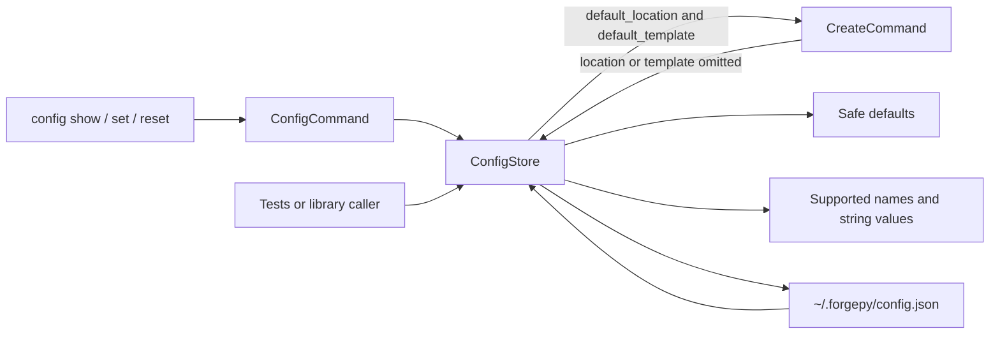
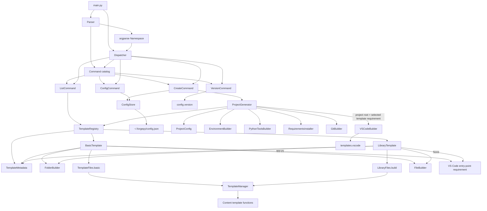
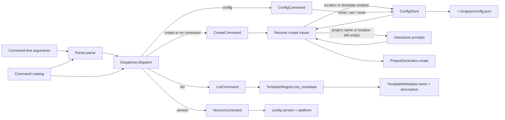
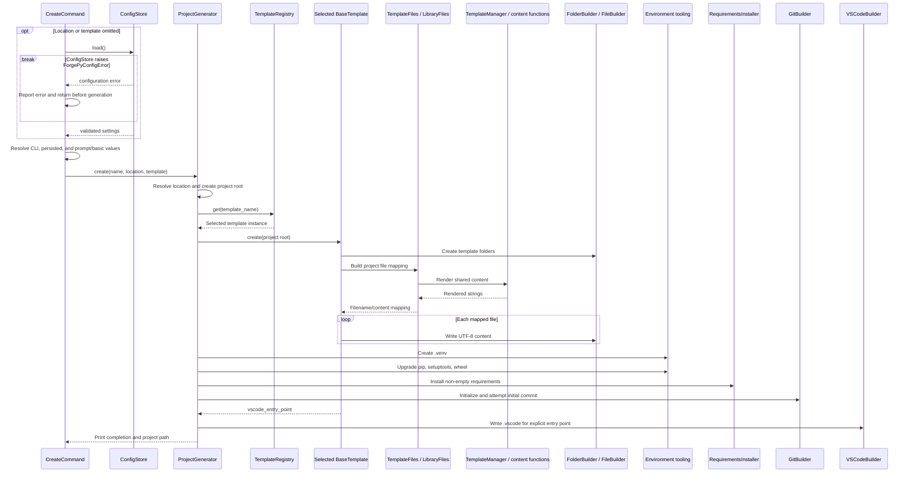

# ForgePy Architecture

## Overview

ForgePy is a layered command-line application. The CLI parses user input and selects a command, the create command delegates to `ProjectGenerator`, and the generator coordinates template rendering and setup services. The template registry keeps descriptive metadata alongside executable templates so listing does not invoke generation. Generated content flows from template functions through the template facade into builders that write to disk.

## Directory structure

```text
ForgePy/
|-- builders/                 Reusable file-system and Python-tool builders
|-- cli/                      Argument parsing, dispatch, and command objects
|   `-- commands/             Implementations and the shared command catalog
|-- config/                   Application and user configuration
|   |-- default_structure.py  Generated project layout defaults
|   |-- user_config.py        Persistent user configuration store
|   `-- version.py            Canonical ForgePy version metadata
|-- core/                     Project workflow and environment/tool integrations
|-- models/                   Project configuration data model
|-- templates/                Generated file content and template facade
|   |-- basic/                Basic project template implementation
|   |-- library/              Minimal Python library template implementation
|   |-- template_engine/      Template contract, metadata, registry, and file mapping
|   `-- vscode/               VS Code JSON content generators
|-- utils/                    Reserved utility package; logger is currently empty
|-- main.py                   Application entry point
|-- config.py                 Empty root module
|-- README.md                 Project README; currently empty
|-- AGENTS.md                 Working rules for human and AI agents
|-- ARCHITECTURE.md           Current structure and dependency flows
|-- CONTRIBUTING.md           Contribution and review workflow
|-- ENGINEERING_PRINCIPLES.md Engineering policy and completion criteria
|-- PROJECT_CONTEXT.md        Current development and handoff context
|-- ROADMAP.md                Implemented, active, planned, and idea states
|-- tests/                    Standard-library automated tests
`-- requirements.txt          Runtime dependency file; currently empty
```

## Module responsibilities

| Area | Responsibility |
| --- | --- |
| `main.py` | Connects `Parser` to `Dispatcher`. |
| `cli/parser.py` | Defines CLI syntax, defaults, and subcommands. |
| `cli/command.py` | Defines command metadata, parser configuration, and execution contracts. |
| `cli/commands/__init__.py` | Registers the built-in commands in one explicit catalog. |
| `cli/commands/create_command.py` | Resolves project name, location, and template inputs before invoking project generation. |
| `cli/commands/config_command.py` | Adapts configuration actions, output, and ForgePy configuration errors for the CLI. |
| `cli/dispatcher.py` | Builds command lookup from the shared catalog; defaults to `create`. |
| `cli/commands/` | Validates command-level input and invokes application services. |
| `models/project_config.py` | Stores project name and location and derives the root path. |
| `core/project_generator.py` | Orchestrates the complete create workflow. |
| `core/environment_builder.py` | Creates `.venv` with the running Python interpreter. |
| `core/requirements_installer.py` | Installs the generated requirements with the new environment's `pip.exe`. |
| `core/git_builder.py` | Initializes Git, stages files, and attempts the initial commit. |
| `core/vscode_builder.py` | Renders and writes `.vscode` files for an explicit template entry-point requirement. |
| `builders/` | Creates folders/files and upgrades Python packaging tools. |
| `templates/basic/basic_template.py` | Generates the established general starter layout. |
| `templates/library/library_template.py` | Normalizes the import-package name and coordinates the minimal library layout. |
| `templates/library/library_files.py` | Maps shared root content and empty package initializer files for `library`. |
| `templates/template_engine/base_template.py` | Defines the stable template name, metadata, creation, and VS Code entry-point contracts. |
| `templates/template_engine/template_metadata.py` | Defines immutable descriptive metadata for registered templates. |
| `templates/template_engine/template_registry.py` | Registers templates by metadata name and supplies template and metadata lookups. |
| `templates/template_engine/template_files.py` | Maps generated root-file names to rendered content. |
| `templates/template_manager.py` | Provides one facade over generated root-file content. |
| `config/default_structure.py` | Supplies the basic generated-project directory list. |
| `config/user_config.py` | Loads, validates, updates, resets, and atomically saves user-level JSON configuration. |
| `config/version.py` | Supplies canonical application metadata. |
| `tests/test_config_command.py` | Verifies configuration parsing, dispatch, output, persistence, reset, and error handling with an isolated home. |
| `tests/test_create_command.py` | Verifies create-input precedence, prompting, configuration errors, and generator delegation without generating a project. |
| `tests/test_library_template.py` | Verifies library metadata, registration, exact output, name normalization, generator selection, and basic compatibility in temporary directories. |
| `tests/test_template_registry.py` | Verifies metadata, registration, lookup compatibility, and list output without generation or file-system effects. |
| `tests/test_user_config.py` | Verifies configuration behavior in temporary home directories. |
| `tests/test_vscode_builder.py` | Verifies template-aware editor output for both built-in templates in temporary directories. |

## Version Source

`config/version.py` is the canonical source for the ForgePy application version. `VersionCommand` imports `APP_NAME` and `VERSION` from that module and adds the conventional `v` prefix only when displaying the release. Module docstrings do not duplicate release numbers.

Versions rendered into generated projects, template metadata versions, and version fields required by VS Code JSON schemas are independent of the ForgePy release version. The `basic` metadata records `0.6.0` and `library` starts at `0.1.0` as independent template revisions; this does not make `config/version.py` a template-version source.

## User Configuration

`ConfigStore` persists user-level settings at `~/.forgepy/config.json`. Its constructor accepts an alternate home directory so tests and library callers can isolate all file-system effects. `ConfigCommand` exposes the store without duplicating its validation or persistence rules.



The supported defaults are `default_template = "basic"`, `default_location = ""`, `author = ""`, and `license = "MIT"`. Loading a missing file returns a new defaults dictionary without creating the directory. Saving creates the directory and atomically replaces the JSON file. Updates preserve other settings; reset is the explicit operation that replaces persisted content with defaults.

`config show` delegates to `ConfigStore.load()`, `config set KEY VALUE` delegates to `ConfigStore.update()`, and `config reset` delegates to `ConfigStore.reset()`. The command formats successful output and converts errors derived from `ForgePyConfigError` into concise CLI messages. A failed show or set does not replace malformed user data; reset is the explicit recovery operation that persists defaults.

When `--location` or `--template` is omitted, `CreateCommand` loads configuration once and resolves only `default_location` and `default_template`. Explicit arguments have priority. An empty configured location preserves the existing prompt, and an empty configured template falls back to `"basic"`. If the required read fails, the command reports the ForgePy configuration error and stops before prompting or generation. When both options are explicit, configuration is not read.

`author` and `license` remain persisted but unused. `ProjectGenerator`, builders, and templates do not import the store or receive its mapping, so the generation lifecycle and generated files are unchanged.

## Dependency flow



CLI and orchestration layers depend on lower-level services. Template content modules do not depend on the CLI or generator. Builders receive paths and content rather than parsing arguments or selecting templates.

## Class relationships

- `Command` defines the shared name, help metadata, parser-configuration hook, and execution contract implemented by `CreateCommand`, `ListCommand`, `VersionCommand`, and `ConfigCommand`.
- `cli.commands.create_commands()` is the single built-in command catalog used by both `Parser` and `Dispatcher`.
- `Dispatcher` derives its CLI-name mapping from that catalog.
- `CreateCommand` resolves explicit, persisted, and interactive/default inputs before invoking `ProjectGenerator`; `ListCommand` reads descriptive metadata from `TemplateRegistry`, `VersionCommand` reads canonical application-version metadata, and `ConfigCommand` delegates user-setting operations to `ConfigStore`.
- `ProjectConfig` is a slotted dataclass used by `ProjectGenerator` to derive the target root.
- `TemplateMetadata` is a frozen, slotted dataclass containing `name`, `description`, template `version`, `author`, and immutable `tags`. Construction validates scalar types, rejects empty or whitespace-only names, and snapshots tag iterables as tuples.
- `BaseTemplate` keeps its stable `name` and `create()` contracts, supplies compatibility metadata for legacy subclasses, and exposes a compatibility `vscode_entry_point` of `"app.py"`. `BasicTemplate` explicitly retains that entry point; `LibraryTemplate` explicitly returns `None` because it has no runnable application file.
- `TemplateRegistry.register()` is the single extension path. It accepts only `BaseTemplate` instances with `TemplateMetadata`, rejects empty names, requires `metadata.name` to match `template.name`, and rejects duplicates before changing registry state. It stores the template and metadata together under the authoritative metadata name. `get()` still returns the executable `BaseTemplate`; `get_metadata()` and `list_metadata()` expose descriptive data separately.
- `list_templates()` and the public `templates` view retain their existing name-to-template dictionary shape for compatibility, but return defensive snapshots so callers cannot desynchronize registry state.
- `BaseBuilder` is the parent of `FileBuilder`, `FolderBuilder`, and `PythonToolsBuilder`; it currently defines no methods.
- Core builder-style services are coordinated directly by `ProjectGenerator` and do not inherit from `BaseBuilder`.

## Template system

The registry registers `BasicTemplate` first and `LibraryTemplate` second through `register()`. Each registration stores its executable instance and immutable `TemplateMetadata` under the stable metadata name. `get("basic")` and `get("library")` return the corresponding creatable template, while `get_metadata()` and `list_metadata()` provide presentation data without invoking `create()`. The legacy `list_templates()` mapping remains available.

Template metadata descriptions and tags are limited to implemented behavior. Template revisions are separate from the ForgePy application version and the version rendered into a generated project. `ListCommand` displays only metadata name and description, in registry order.

`BasicTemplate.create()` performs two stages:

1. `FolderBuilder` creates every directory in `config.default_structure.DEFAULT_FOLDERS`.
2. `TemplateFiles.basic()` renders the root-file mapping, and `FileBuilder` writes each entry as UTF-8.

The mapping currently generates `README.md`, `.gitignore`, `requirements.txt`, `app.py`, `LICENSE`, `CHANGELOG.md`, `.env`, `.env.example`, and `pyproject.toml`. Content is produced by functions exposed through `TemplateManager`.

`LibraryTemplate.create()` derives an import-package name from the project-root name. It lowercases the name, replaces runs of characters outside ASCII `[a-z0-9_]` with `_`, strips surrounding underscores, prefixes a leading digit, and suffixes a Python keyword. It then uses the existing `FolderBuilder` and `FileBuilder` to create this minimal template-owned structure:

```text
<project-root>/
|-- <normalized-package>/
|   `-- __init__.py
|-- tests/
|   `-- __init__.py
|-- .gitignore
|-- README.md
|-- pyproject.toml
`-- requirements.txt
```

`LibraryFiles.build()` reuses the existing README, Git-ignore, and pyproject renderers without modifying them. The library requirements file and both initializer files are empty. The original project name remains in README and pyproject content; normalization applies only to the import-package directory.

VS Code files are not part of either template's file mapping. Each template instead describes whether it has a runnable editor entry point. After the rest of project setup, `ProjectGenerator` forwards that explicit value to `VSCodeBuilder`, which calls the functions in `templates/vscode/` and writes four JSON files under `.vscode/`.

For `basic`, the entry point is `app.py`; its existing launch configuration and `Run Application` task are preserved. For `library`, the entry point is `None`; `launch.json` has an empty `configurations` list and `tasks.json` retains only `Install Requirements`. Shared settings and extension recommendations remain unchanged. The builder does not inspect the generated filesystem to choose a profile.

## CLI flow



### Startup and dispatch

1. `main()` creates `Parser` and parses `sys.argv` through `argparse`.
2. `Dispatcher` selects `create`, `list`, `version`, or `config`.
3. With no subcommand, the dispatcher selects `create` for interactive compatibility.
4. The selected command receives the parsed `Namespace`.

### Configuration workflow

`ConfigCommand` owns the nested `show`, `set`, and `reset` syntax. It lazily creates a default `ConfigStore` only when a configuration action executes; tests inject a store rooted in a temporary home directory.

1. `show` loads the effective configuration and displays every supported setting. A missing file produces defaults without creating the configuration directory.
2. `set KEY VALUE` asks the store to validate and persist one setting while preserving the others.
3. `reset` explicitly persists all safe defaults, including when recovery from malformed content is required.
4. Store errors are displayed with a ForgePy error prefix and no traceback.

`ConfigCommand` manages all four persistent values. Separately, `CreateCommand` may read only `default_location` and `default_template` while resolving omitted create options. Neither command passes the store or configuration mapping into `ProjectGenerator`.

### Create workflow

`CreateCommand` uses these independent precedence rules before calling `ProjectGenerator.create()`:

1. Project name: explicit positional argument, then the existing prompt.
2. Location: explicit `--location`, then non-empty `default_location`, then the existing prompt.
3. Template: explicit `--template`, then non-empty `default_template`, then `"basic"`.

Argparse uses `None` for an omitted template so an explicit `--template basic` remains distinguishable from omission. The store is loaded only when location or template is omitted. A malformed or unreadable required configuration aborts resolution with a clear error; it is not overwritten or silently replaced by the fallback.

The generator then executes these stages in order:

1. Resolve the requested parent location and confirm that the path exists.
2. Create the project root.
3. Look up and create the selected template.
4. Create `.venv`.
5. Upgrade `pip`, `setuptools`, and `wheel`.
6. Install packages from `requirements.txt` when present and non-empty.
7. Initialize Git and attempt an initial commit.
8. Write Visual Studio Code configuration.
9. Print the resulting project path.



The current implementation uses Windows executable paths such as `.venv/Scripts/python.exe` and `.venv/Scripts/pip.exe`.

## Known limitations and technical debt

- The full generation lifecycle assumes Windows `.venv/Scripts/*.exe` paths.
- Automated coverage includes user configuration, create-input resolution, template metadata and registry behavior, list output, both built-in template structures, template-aware VS Code output, and isolated selection through `ProjectGenerator`; the real external lifecycle and other application areas remain uncovered.
- `author` and `license` are persisted but not applied to generated content.
- `TemplateRegistry.get()` raises `KeyError` for unknown names rather than producing a command-level error.
- Template metadata has no independent versioning policy yet; `basic` records `0.6.0` and `library` starts at `0.1.0` as template-specific revisions.
- Most subprocess failures propagate; only the initial Git commit has local error handling.
- The generator writes into an existing project root because it uses `exist_ok=True`.
- `BaseBuilder` has no behavioral contract, and core builder-style services do not share its inheritance hierarchy.
- `config.default_structure.DEFAULT_FILES` is currently unused; `TemplateFiles.basic()` and `LibraryFiles.build()` are authoritative for their respective generated files.
- The root README, requirements file, root `config.py`, and utility logger are empty.

## Safe extension rules

Apply the design principles and Definition of Done in [`ENGINEERING_PRINCIPLES.md`](ENGINEERING_PRINCIPLES.md) to every architectural change.

### Commands

- Implement the `Command` metadata and `execute(args)` contract; override `configure_parser()` only when the command accepts arguments.
- Add the command to `cli.commands.create_commands()`. Parser and dispatcher registration then follow automatically.
- Keep argument parsing out of core services and preserve the no-command interactive create fallback.
- Add tests or documented manual checks for dispatch, validation, and existing commands.

### Templates

- Implement `BaseTemplate` with `TemplateMetadata`: a non-empty stable `name`; factual string `description`; string template `version` and `author`; and an iterable of string `tags` stored as a tuple.
- Keep the metadata name aligned with `BaseTemplate.name`, keep rendered content separate from file writes, and register through `TemplateRegistry.register()`.
- Explicitly declare `vscode_entry_point`: use the real generated path for a runnable template or `None` when no application entry point exists. Do not infer it from the filesystem.
- Do not change the `basic` or `library` names or output contracts incidentally.
- Verify metadata registration, registry listing and selection, generated folders/files, and template-matched VS Code JSON in an isolated location.

### User Configuration

- Keep persistence and validation in `ConfigStore`; `ConfigCommand` should contain only CLI parsing, presentation, and error adaptation.
- Resolve `default_location` and `default_template` in `CreateCommand` with explicit CLI values first and existing prompt/basic behavior last.
- Keep `ProjectGenerator`, builders, and templates independent of `ConfigStore`; applying `author` or `license` requires a separate explicit requirement.
- Add supported settings to the defaults and validation schema together.
- Preserve malformed files on load/update failures, and use injected temporary home directories in tests.

### Core lifecycle

- Keep sequencing in `ProjectGenerator` and side effects in focused builders/services.
- Preserve stage order and existing user-visible behavior unless a reviewed requirement explicitly changes them.
- Avoid circular dependencies from templates or builders back into the CLI.
