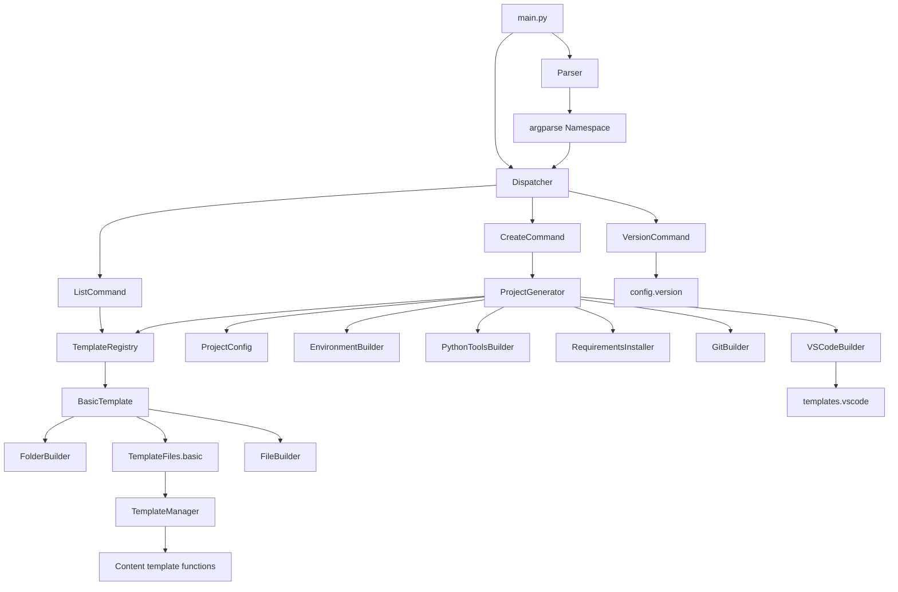
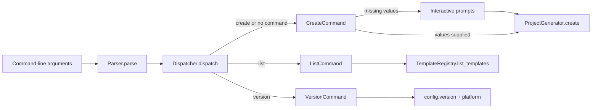
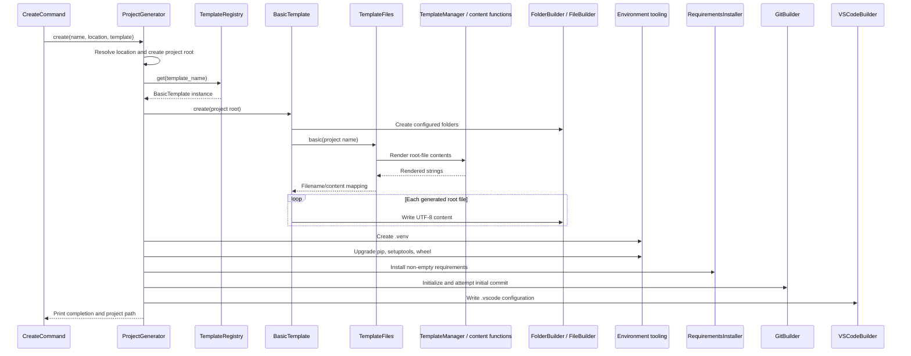

# ForgePy Architecture

## Overview

ForgePy is a layered command-line application. The CLI parses user input and selects a command, the create command delegates to `ProjectGenerator`, and the generator coordinates template rendering and setup services. Generated content flows from template functions through the template facade into builders that write to disk.

## Directory structure

```text
ForgePy/
|-- builders/                 Reusable file-system and Python-tool builders
|-- cli/                      Argument parsing, dispatch, and command objects
|   `-- commands/             create, list, and version implementations
|-- config/                   Version constants and default project layout
|-- core/                     Project workflow and environment/tool integrations
|-- models/                   Project configuration data model
|-- templates/                Generated file content and template facade
|   |-- basic/                Basic project template implementation
|   |-- template_engine/      Template contract, registry, and file mapping
|   `-- vscode/               VS Code JSON content generators
|-- utils/                    Reserved utility package; logger is currently empty
|-- main.py                   Application entry point
|-- config.py                 Empty root module
|-- README.md                 Project README; currently empty
|-- AGENTS.md                 Working rules for human and AI agents
|-- ARCHITECTURE.md           Current structure and dependency flows
|-- CONTRIBUTING.md           Contribution and review workflow
|-- ENGINEERING_PRINCIPLES.md Engineering policy and completion criteria
|-- PROJECT_CONTEXT.md        Current development and handoff context
|-- ROADMAP.md                Implemented, active, planned, and idea states
`-- requirements.txt          Runtime dependency file; currently empty
```

## Module responsibilities

| Area | Responsibility |
| --- | --- |
| `main.py` | Connects `Parser` to `Dispatcher`. |
| `cli/parser.py` | Defines CLI syntax, defaults, and subcommands. |
| `cli/dispatcher.py` | Maps command names to `Command` implementations; defaults to `create`. |
| `cli/commands/` | Validates command-level input and invokes application services. |
| `models/project_config.py` | Stores project name and location and derives the root path. |
| `core/project_generator.py` | Orchestrates the complete create workflow. |
| `core/environment_builder.py` | Creates `.venv` with the running Python interpreter. |
| `core/requirements_installer.py` | Installs the generated requirements with the new environment's `pip.exe`. |
| `core/git_builder.py` | Initializes Git, stages files, and attempts the initial commit. |
| `core/vscode_builder.py` | Writes `.vscode` configuration files. |
| `builders/` | Creates folders/files and upgrades Python packaging tools. |
| `templates/template_engine/` | Defines, registers, and supplies project templates. |
| `templates/template_manager.py` | Provides one facade over generated root-file content. |
| `config/` | Supplies application metadata and the basic directory list. |

## Dependency flow



CLI and orchestration layers depend on lower-level services. Template content modules do not depend on the CLI or generator. Builders receive paths and content rather than parsing arguments or selecting templates.

## Class relationships

- `Command` is an abstract base implemented by `CreateCommand`, `ListCommand`, and `VersionCommand`.
- `Dispatcher` owns a mapping of CLI names to those command objects.
- `CreateCommand` invokes `ProjectGenerator`; the other commands query configuration or the template registry directly.
- `ProjectConfig` is a slotted dataclass used by `ProjectGenerator` to derive the target root.
- `BaseTemplate` is implemented by `BasicTemplate` and stored by `TemplateRegistry`.
- `BaseBuilder` is the parent of `FileBuilder`, `FolderBuilder`, and `PythonToolsBuilder`; it currently defines no methods.
- Core builder-style services are coordinated directly by `ProjectGenerator` and do not inherit from `BaseBuilder`.

## Template system

The registry currently contains only `"basic": BasicTemplate()`. A lookup returns the instance by dictionary key. `BasicTemplate.create()` performs two stages:

1. `FolderBuilder` creates every directory in `config.default_structure.DEFAULT_FOLDERS`.
2. `TemplateFiles.basic()` renders the root-file mapping, and `FileBuilder` writes each entry as UTF-8.

The mapping currently generates `README.md`, `.gitignore`, `requirements.txt`, `app.py`, `LICENSE`, `CHANGELOG.md`, `.env`, `.env.example`, and `pyproject.toml`. Content is produced by functions exposed through `TemplateManager`.

VS Code files are not part of `TemplateFiles`. After the rest of project setup, `VSCodeBuilder` calls the functions in `templates/vscode/` and writes JSON under `.vscode/`.

## CLI flow



### Startup and dispatch

1. `main()` creates `Parser` and parses `sys.argv` through `argparse`.
2. `Dispatcher` selects `create`, `list`, or `version`.
3. With no subcommand, the dispatcher selects `create` for interactive compatibility.
4. The selected command receives the parsed `Namespace`.

### Create workflow

`CreateCommand` obtains a project name and location from arguments or interactive prompts, validates that neither is empty, and calls `ProjectGenerator.create()`.

The generator then executes these stages in order:

1. Resolve the requested parent location and confirm that the path exists.
2. Create the project root.
3. Look up and create the selected template.
4. Create `.venv`.
5. Upgrade `pip`, `setuptools`, and `wheel`.
6. Install packages from `requirements.txt` when present and non-empty.
7. Initialize Git and attempt an initial commit.
8. Write Visual Studio Code configuration.
9. Print the resulting project path.



The current implementation uses Windows executable paths such as `.venv/Scripts/python.exe` and `.venv/Scripts/pip.exe`.

## Known limitations and technical debt

- Version sources conflict: the stable tag is `v0.6.0`, runtime configuration says `0.4.0`, builder headers include `v0.6.4`, CLI headers say `v0.7.2`, and other source headers still include `v0.4.0`.
- The full generation lifecycle assumes Windows `.venv/Scripts/*.exe` paths.
- There is no automated test suite or declared test framework.
- `TemplateRegistry.get()` raises `KeyError` for unknown names rather than producing a command-level error.
- Most subprocess failures propagate; only the initial Git commit has local error handling.
- The generator writes into an existing project root because it uses `exist_ok=True`.
- `BaseBuilder` has no behavioral contract, and core builder-style services do not share its inheritance hierarchy.
- `config.default_structure.DEFAULT_FILES` is currently unused; `TemplateFiles.basic()` is authoritative for generated root files.
- The root README, requirements file, root `config.py`, and utility logger are empty.

## Safe extension rules

Apply the design principles and Definition of Done in [`ENGINEERING_PRINCIPLES.md`](ENGINEERING_PRINCIPLES.md) to every architectural change.

### Commands

- Implement `Command.execute(args)`, register the instance in `Dispatcher`, and define syntax in `Parser`.
- Keep argument parsing out of core services and preserve the no-command interactive create fallback.
- Add tests or documented manual checks for dispatch, validation, and existing commands.

### Templates

- Implement `BaseTemplate`, keep rendered content separate from file writes, and register it in `TemplateRegistry`.
- Do not change the `basic` name or output contract incidentally.
- Verify registry listing, selection, generated folders, and generated files in an isolated location.

### Core lifecycle

- Keep sequencing in `ProjectGenerator` and side effects in focused builders/services.
- Preserve stage order and existing user-visible behavior unless a reviewed requirement explicitly changes them.
- Avoid circular dependencies from templates or builders back into the CLI.
